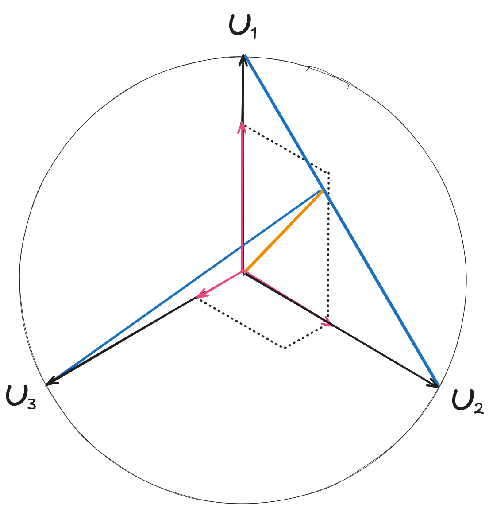

# Przed sprawozdaniem (chyba)

pon, 9 gru 2024, 10:30:37 CET

| Lp. | $U_1$ | $U_2$ | $U_3$ | $I_1$ | $I_2$ | $I_3$ | $I_N$ | $P_1$ | $P_2$ | $P_3$ | $\Sigma P$ | $S_1$ | $S_2$ | $S_3$ | $\Sigma S$ | $cos  \phi$ | $sin  \phi$ |
| --- | ----- | ----- | ----- | ----- | ----- | ----- | ----- | ----- | ----- | ----- | ---------- | ----- | ----- | ----- | ---------- | ----------- | ----------- |
| -   | V     | V     | V     | A     | A     | A     | A     | W     | W     | W     | W          | VA    | VA    | VA    | VA         | -           | -           |
|     |       |       |       |       |       |       |       |       |       |       |            |       |       |       |            |             |             |

1) $Z_1$ = $Z_2$ = $Z_3$ ; W = Z

2) $Z_1$ = $Z_2$ = $Z_3$ ; W = 0

3) $Z_1$ = $Z_2$ , $Z_3$ = 0 ; W = Z

4) $Z_1$ = $Z_2$ , $Z_3$ = 0 ; W = 0

5) $Z_1$ $!=$ $Z_2$ != $Z_3$ = 0 ; W = Z

# Zadanie styczniki

zrobić na podstawie: https://iautomatyka.pl/jak-czytac-schematy-elektryczne-i-akpia-3-styczniki/
